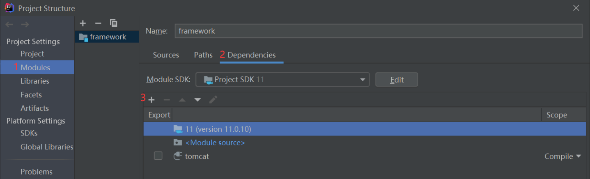
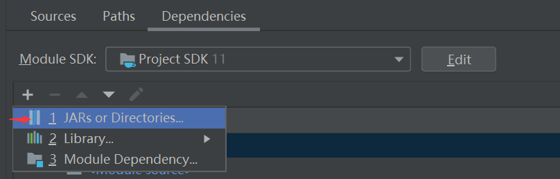

# 开发日志
仿照大佬的项目：[仿写一个简陋的 IOC/AOP 框架 mini-spring](https://www.cnblogs.com/czwbig/p/11159946.html)
#### 2021/5/14

Servlet、Tomcat相关的jar包很折腾，毕竟它们是属于javaEE规范的，javaSE中并没有这些包。我尝试过用maven来添加servlet依赖，但是又发现Tomcat相关的类却不在jakarta.servlet包中，而是在org.apache.catalina包中，在maven远程仓库中却找不到。于是我直接导入了tomcat服务器目录下的lib目录下的所有jar包。具体做法是：



然后导入一个选择tomcat下的lib目录导入即可。其实我觉得也可以把这个lib当作library来导入，因为本质都是一样的（已测试。没问题）。




#### 2021/5/15

**JarURLConnection**:

> A URL Connection to a Java ARchive (JAR) file or an entry in a JAR file.
> The syntax of a JAR URL is:
> jar:<url>!/{entry}
>
> for example:
> jar:http://www.foo.com/bar/baz.jar!/COM/foo/Quux.class
> Jar URLs should be used to refer to a JAR file or entries in a JAR file. The example above is a JAR URL which refers to a JAR entry. If the entry name is omitted, the URL refers to the whole JAR file: jar:http://www.foo.com/bar/baz.jar!/
>
> Users should cast the generic URLConnection to a JarURLConnection when they know that the URL they created is a JAR URL, and they need JAR-specific functionality. For example:
>
> ``` java
> URL url = new URL("jar:file:/home/duke/duke.jar!/");
> JarURLConnection jarConnection = (JarURLConnection)url.openConnection();
> Manifest manifest = jarConnection.getManifest();
> ```
>
> 一个对jar文件的URL链接，或者**一个**JAR文件中的entry。
>
> 比如：
> jar:http://www.foo.com/bar/baz.jar!/COM/foo/Quux.class
> JAR URL应该用于指向一个jar文件或者jar文件中的entry们。上面的例子是指向一个jar entry的jar url。但如果entry的名字被忽略了，那么这个url就指向整个jar文件：http://www.foo.com/bar/baz.jar!/
>
> 当用户知道他们创建的URL是一个JAR URL，那么就可以将返回的URLConnection 强转为JarURLConnection，这样就会有JAR包独有的功能了。比如：（代码略）


**Class#newInstance()**

> This method propagates any exception thrown by the nullary constructor, including a checked exception. Use of this method effectively bypasses the compile-time exception checking that would otherwise be performed by the compiler. The Constructor.newInstance method avoids this problem by wrapping any exception thrown by the constructor in a (checked) InvocationTargetException.
>
> 这个方法传播了任何被无参构造器的抛出的异常，包括[检查型异常](https://www.cnblogs.com/tjudzj/p/7053980.html) 。采用该方法能有效地绕过编译时期的异常检查[^1]。调用Constructor#newInstance()避免了这个问题，通过将所有的被构造器抛出的异常封装到InvocationTargetException（这是一个检查型异常）中。


[^1]: 结合语境（@Deprecated），这句话并不是在赞扬，而是在指出一个问题。


#### 2021/5/17

解决了5/14日遇到的问题，看了原项目的gradle中引入的依赖，原来是

```xml
<dependency>
    <groupId>org.apache.tomcat.embed</groupId>
    <artifactId>tomcat-embed-core</artifactId>
    <version>9.0.41</version>
</dependency>
```

里面有我所有想要的包，不用把tomcat的lib目录下的jar包都导入了。

#### 2021/6/1

项目闲置了一段时间，主要是准备期末考试和开源之夏的比赛。目前这个项目卡在了`ClassScanner`处，好像解析目录的结构和包含的资源失败。
我感觉需要查阅更多的文章来获取解决方法，于是这里记录一下收集的资料，以便期末考试结束后继续学习的时候有思路：

- https://github.com/code4craft/tiny-spring 该项目应该是很多学习手写spring框架的原始参考项目，因为点赞最多，而且有它相关的博客:  [tiny-spring 分析](https://www.zybuluo.com/dugu9sword/note/382745) 
- https://github.com/DerekYRC/mini-spring/blob/main/README_CN.md 这个项目的点赞也很多，可以作为候选参考


#### 2021/6/21

既然有反射这么强悍的东西，那我岂不是可以在spring的基础上搞一些花里胡哨的东西，比如可以检查service中或者dao中是否有属性，然后给出警告，提示尽量不要在其中保有数据，因为service应该是无状态的单例。

#### 2021/6/22

区别`Class#getMethods()`和`Class#getDeclaredMethods`

> getMethods():
>
> Returns an array containing Method objects reflecting all the public methods of the class or interface represented by this Class object, including those declared by the class or interface and those inherited from superclasses and superinterfaces.
>
> 返回一个数组，这个数组的元素是Method类型的对象，这些Method对象反射的都是该类或接口的**public**方法，也包括该类的父类或父接口的public方法。

> getDeclaredMethods():
>
> Returns an array containing Method objects reflecting all the declared methods of the class or interface represented by this Class object, including public, protected, default (package) access, and private methods, but excluding inherited methods.
>
> 与getMethods()对比，包含的不只是public访问权限的了，是包括所有访问权限的。


#### 2021/6/23

解决了大问题！修改了内嵌tomcat的实现方式，参考代码为https://github.com/ypl1306961052/tomcatservice/blob/master/src/main/java/ypl/TomcatBootStarp.java

现在可以正常启动项目了！

同时，发现原项目的`MiniApplication`中启动tomcat服务和handler的顺序可能有问题。我觉得应该是先handler再启动tomcat服务器。
后来我发现问题的症结不在此，其实这个顺序是无所谓的，关键是`TomcatServer#startServer()`最后一段代码：

```java
tomcat.getServer().await();
```

说明文档为

```markdown
Wait until a proper shutdown command is received, then return.

等待，直到收到合适的shutdown命令，然后返回
```

也就是说，线程在这里是会阻塞的，而且不会释放cpu资源，于是，如果handler在此之后，就不会执行了。

#### 2021/6/24

试一试采用cglib实现动态代理呢，我觉得难点应该在于如何和jdk的动态代理兼容。

beansHaveAutoWiredField的流程我觉得需要优化一下，可以先不实例化这类Class对象，在创建动态对象、创建普通对象之后在创建有AutoWired注解的属性的Class。这里暂时不考虑循环依赖的问题

#### 2021/6/26

- 解决了循环依赖的问题

> Spring中一个bean依赖于另一个bean的时候，可以通过构造器注入或setter注入，其中setter注入又可以分为单例和多例(prototype)。
> 
> 1.如果是构造注入或多例模式的setter注入的时候，循环依赖是解决不了的；
> 
> 2.🎈如果是单例setter注入则可以解决掉循环依赖问题。原因在于Spring是先将Bean对象实例化之后再设置对象属性的而不是一次性将bean对象连同属性一起构造的。
> 
> 来自：https://github.com/code4craft/tiny-spring/issues/13

- 接下来其实可以尝试一些拦截器，也就是创建bean实例的时候不要单纯地`newInstance()`，还可以对该对象设置代理。这应该有点难了。

#### 2021/7/10

一个有关aop的细节：

Rapper是Rap的实现类，同时spring用jdk的方式动态代理了Rapper，那么这个Rapper的代理类`class com.sun.proxy.$Proxy8`，
也是实现了Rap接口，即`Rapper`和`com.sun.proxy.$Proxy8`都是Rap接口的子类。现在问题来了，
如果@AutoWired的是Rapper：

```java
@AutoWired
Rapper rapper;
```
而不是Rap，会出现什么情况？会有如下报错：
```markdown
Can not set com.dong6662.demo.service.Rapper field com.dong6662.demo.service.JobService.rapper to com.sun.proxy.$Proxy8
```
分析原因：**在bean容器中是没有Rapper实例本身的，有的只是Rapper的代理对象`com.sun.proxy.$Proxy8`！**
有了这个观点，就很好理解了，Rapper和com.sun.proxy.$Proxy8是没有继承关系的，自然没有多态或者强转啥的，即com.sun.proxy.$Proxy8实例是无法赋值给Rapper实例的，于是就有了上面的报错。

但是用cglib应该不存在上面的问题，如果这么做，Rapper的cglib代理类是Rapper的子类！多态就可以用上了。


#### 2021/7/11

尝试模拟[模拟Spring事务 · 语雀 (yuque.com)](https://www.yuque.com/books/share/2b434c74-ed3a-470e-b148-b4c94ba14535/bywitu)，其实原理比较简单，实现也比较简单，但是感觉代理这个地方不是很智能，用cglib实现代理似乎要好些。

